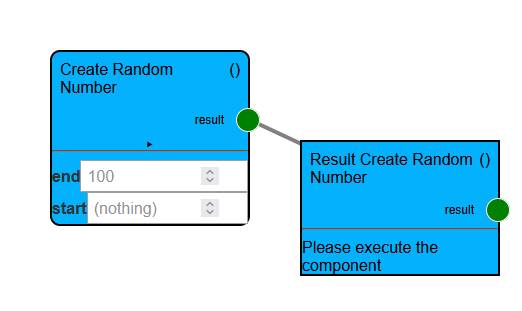
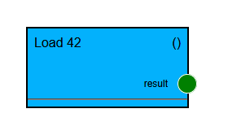
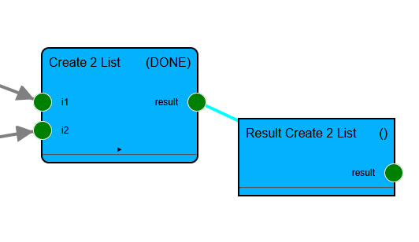
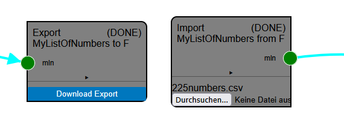

# Components

## Components
A component is the building block of the workbench.
They represent functions, turning inputs into one output.
(In the UI, they are represented by the rounded corner blocks.
Square corners are used to show the results of a computation.)

```python
@wbgeo_component(identifier='wbgeo::creation_create_random_number',
                 title='Create Random Number',
                 description='Create a random number', color='#03b1fc')
def create_random_number(start: int, end: int = 100) -> int:
   """
   Create a new random number within bounds
   :param start: int the lower bound
   :param end: int the upper bound (defaults to 100)
   :return: random number within the given bounds
   """
   return random.randint(start, end)
```

In this example, the function `create_random_number` is declared as a component.
This is done via the `@wbgeo_component` decorator.
Both of its parameters are declared as inputs.
The second, `end`, parameter is optional (with a default value of 100).
The function's signature MUST be explicit, i.e., contain a returned type and
the type-hints of parameters.



The picture shows the visualization of this component.

| Parameter      | Required   | Description                                                                                         |
|----------------|------------|-----------------------------------------------------------------------------------------------------|
| identifier     | required   | A unique identifier. See below for a naming scheme                                                  |
| title          | required   | The human-readable title shown to users of the workbench                                            |
| description    | (optional) | The description shown to users of the workbench on request (if absent, a pydoc must be present)     |
| input_checks   | (optional) | The pre-checks (see below)                                                                          |
| color          | (optional) | The color of the component                                                                          |
| border_color   | (optional) | The border color of the component                                                                   |
| group          | (optional) | The group this component belongs to                                                                 |
| tags           | (optional) | For internal description                                                                            |
| return_name    | (optional) | The name of the output port, default "result"                                                       |
| is_object_type | (optional) | Some components should be presented like the result (e.g. the loading component), defaults to False |

The execution of the component MUST NOT modify/change its inputs,
i.e. the inputs are immutable.

To be able to uniquely identify each component, you MUST follow the following naming scheme:
`identifier="wbgeo::[semantic_group]_[component_name]".`
For example, `identifier="wbgeo::interpolation_rbf", tags=["Interpolation"]`

The `is_object_type` parameter can be used to display the component like a result,
which is just loaded.
Like in the following example, the number 42 is loaded:



Similarly, when using non-`controlled` inputs, the input ports are always rendered:



#### User-Feedback

To provide feedback to a user,
any output to the standard error stream results in the job completing with a warning.

````python
import sys
print("This results in a warning, consider using a greater threshold value", file=sys.stderr)
````
Each warning should include hints to the user how to "fix" the possible problem.

Any thrown error results in the job failing with the exceptions message being used as the reason:
````python
raise ValueError("Data within the extent does not contain a good candidate for a magic unicorn. Consider using a different extend")
````
Each error should include hints to the user how to "fix" the problem.
If possible, known constraints (e.g., a parameter must fall within a range,
faults must not be present in the data, etc.) should also be checked via pre-checks (see below).
(But pre-checks can be ignored, so they should be checked within the function as well).

#### Pre-checks

Unlike errors during execution,
pre-checks indicate incompatibilities before execution.

In case a component that has been executed (and thus, has a value present)
is connected as an input to your component,
all pre-checks are run.
Pre-checks are functions referenced via the `input_checks` parameter of the components decorator.
Their parameters must be a matching subset of the inputs of the function.

In case a pre-check raises an exception, users will be warned about the problematic connection.

````python
def pre_check_my_interpolator(data: MyDataType):
    raise ValueError("Faults are not supported with the example interpolator. Consider using a different interpolator")

@wbgeo_component(input_checks=[pre_check_my_interpolator], ...)
def my_example_interpolator(data: MyDataType, treshold: int) -> MyResultType:
   # run the pre-checks first (at least those, that are really required)
   pre_check_my_interpolator(data)
   # do execution
   return MyResultType(...)
````

(Note: Only those pre-checks are run whose inputs have already been computed/are present.
This requires the invocation of the checks during the execution again.)

### Inspection components

To enable users to inspect a result,
special inspect functions can be defined.
Their textual output (`print(str)`), matplotlib rendering,
as well as pyvista plotter output is rendered on the UI.
Unlike normal components,
inspection components do not specify a return type.
(By default, they also receive the `__visualizer` tag,
hiding them from the default list of components.)

Note regarding the identifier:
The semantic group of inspectors MUST BE `inspect`,
followed by the identifier of the type,
optionally followed by a suffix denoting the specific visualization used.
Examples can be `wbgeo::inspect_my_complex_data_type` or
`wbgeo::inspect_my_complex_data_type_2d`.

They can use an optional `_inspector` helper,
which allows them to trace the computation's intermediate results.

`````python
@wbgeo_component(identifier='wbgeo::inspect_my_complex_data_type',
                 title='Visualize Example',
                 description='...')
@wbgeo_inspector()
async def _visualize_complex(i: MyComplexDataType, _inspector: InspectorHelper):
   #
   # Option 1: Use print(...) to output something
   print(i.name)
   print(":")
   print(str(i.numbers))
   print("----")

   # retrieve a value 
   # (note: this API is subject to change)
   trace = await _inspector.trace(MyListOfNumbers)
   if trace:
      print("value", await trace.get_value(), "end-value")
   else:
      print("no List of numbers found")

   # Option 2: Use the pv.Plotter
   import pyvista as pv
   mesh = pv.Cube()
   another_mesh = pv.Sphere()
   pl = pv.Plotter()
   pl.add_mesh(mesh, color='red', style='wireframe', line_width=4)
   pl.add_mesh(another_mesh, color='#03b1fc')
   pl.show()

   # Option 3: Use matplotlib
   import matplotlib.pyplot as plt
   import numpy as np

   xpoints = np.array([1, 8])
   ypoints = np.array([3, 10])

   plt.plot(xpoints, ypoints)
   plt.show()
`````

### Import / Export components
While each computation's result is stored by the workbench,
some workflows require interaction outside the workbench.

By using the `nodesapi.BasicallyABufferedFile` type as an input or as the resulting type,
users can upload/import files to a workflow or download an export of data.

The following component exports data to a `io.BytesIO` buffer,
when is then downloadable by a user:

```python
from py_api_wbgeo.nodesapi import wbgeo_component, BasicallyABufferedFile
@wbgeo_component(title='Export MyListOfNumbers',
                 description='Export MyListOfNumbers to file',
                 group='Export',
                 identifier='py::export_MyListOfNumbers_to_file',
                 )
def export_to_file(mln: MyListOfNumbers) -> BasicallyABufferedFile:
  buf = io.BytesIO() # create new (buffered in memory) file
  # write to the buffer
  buf.write('My text...'.encode('utf-8'))
  # we can specify a name for the downloaded file
  buf.filename = 'numbers.csv'
  # as long as we return a BytesIO (buffered file)
  return buf
```

The component is visible on the left side of the following picture.



An example of an import is shown to the right and below:
Here the import is


```python
@wbgeo_component(description='Import MyListOfNumbers from F',
                 title='Import MyListOfNumbers from F',  # The title shown in the GUI
                 group='Import',
                 identifier='py::import_MyListOfNumbers',
                 return_name='mln'
                 )
def import_mesh_results_to_vtu(file: BasicallyABufferedFile) -> MyListOfNumbers:
  s = file.readlines()
  print("Loading file", file.filename)
  ret = [int(i.decode('utf-8')) for i in s[1:]]
  if len(ret) != int(s[0].decode('utf-8')):
    raise ValueError('Expected length did not match')
  return ret
```

## Dependant Inputs

One special kind of inputs are "dependant inputs",
 i.e. inputs that depend on another input.

For example: Given a list of group names and a CSV input file, the user 
 should be able to select the group of each feature.


```python
from py_api_wbgeo.smartcontrols import CtrlGroup, CtrlOrderedGrouping, SmartInputFormData, SmartInput

SmartStructuralInputSmartInputOptions = typing.Annotated[
  StructuralInputMappingOptions, SmartInput(inputs=['surface_points_file', 'group_names'],
                                          to_form=structural_input_smart_options,
                                          to_data=structural_input_smart_options_to_data)]


@wbgeo_component("...")
def structural_input_smart_options(surface_points_file: SurfaceCSVFileDataType,
                                   group_names: GroupNames
                                   ) -> CtrlGroup:
   return CtrlGroup(id='root', inner=[
      CtrlOrderedGrouping(id='groups',
                          label='Assign Groups',
                          groups=["c1", "c2"], # load this from the inputs
                          items=["a", "b", "c"], # load this from the inputs
                          )
   ]
                    )

@wbgeo_component(...)
def structural_input_smart_options_to_data(
      _input: SmartInputFormData,
      group_names: GroupNames,
) -> StructuralInputMappingOptions:
   input_as_json = smartcontrols.form_data_as_dict(_input)
   grouped = collections.defaultdict(list)
   if "root" in input_as_json and "groups" in input_as_json["root"]:
      for gn in group_names:
         if gn in input_as_json["root"]["groups"]:
            grouped[gn].extend(input_as_json["root"]["groups"][gn])

   return {k: tuple(v) for k, v in grouped.items()}


@wbgeo_component(...)
def my_component(
      surface_points_file: SurfaceCSVFileDataType = 'examples/synthetic_examples/model1/input_data/geological_data/model1_surface_points_df.csv',
      group_names: GroupNames = ['Strat_Series1'],
      mapping_object: SmartStructuralInputSmartInputOptions = {"Strat_Series1": ('rock2', 'rock1')}
) -> InputData_StructuralElements:
    pass
```
 

By using an annotated input type, with an annotation to `SmartInput`,
 an input type is defined as having "smart controls".

Parameters in the smart-input helper component functions with the same name and type 
as the real component will be passed along.

Please take a look at the smart controls file to see a list of available controls.

