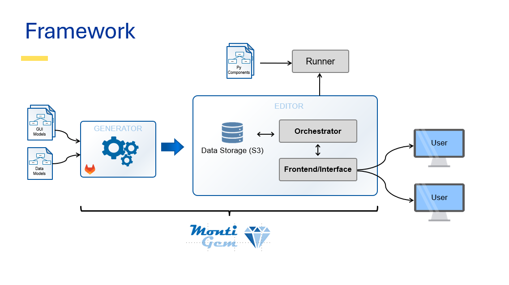
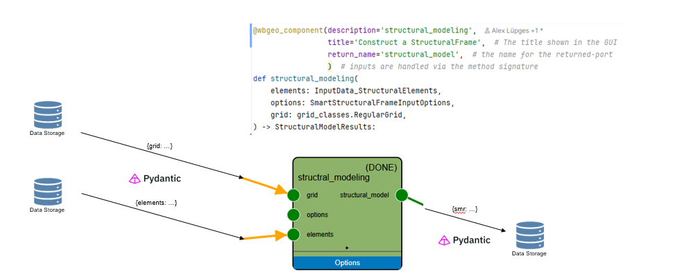

# Developer's Guide

This chapter outlines the functionality of the internal,
decorator-based DSL for component definitions and the infrastructure behind it.


## Abstract Description

The structure of the workbench can abstractly be seen as a _component and connector_ architecture.
Developers will mainly interact with *components* 
 (that compute something) and *types* (as in the input/output type definitions accepted by components).

## Architecture of the Visual Editor

At runtime the user interacts with the frontend/interface,
 which communicates with the orchestrator/backend.

The components itself are provided by runners which register the available type definitions
 and component definitions.
The WBGeo-domain-specific MontiGem protocol is used for communication 
 between the runners and the orchestrator. 
Internally, the MontiGem protocol is built upon WebSockets.


The interface, parts of the orchestrator, and the python domain classes 
are generated using the MontiGem framework from a set of input data and gui models.




## Data Flow

> This section holds true for execution in the context of the visual editor.
> When running an example locally (e.g. as a .py file/jupyter notebook) 
> the following steps do not occur (see below).

Each component is executed in a _runner_.

Before a component is executed:

1. the runner loads the data of all inputs from a data storage
2. then deserializes them to objects
   - For WBGeo, pydantic is used to convert the data's JSON representation
     to python objects.
3. Then the component is executed
   - stdout, stderr, and errors are captures
4. Finally, the result of the computation is serialized (using pydantic to JSON)
   and stored in the data storage.
- Additionally, a hash of the computation is stored among the hashes of all
  inputs.

### Simulated Data Flow in Python Notebooks

When writing example workflows, the (de)serialization step is omitted.
To simulate it, you can add the following lines before importing any other
files.

````python
# Simulate the nodesapi at runtime to also check that (de)serialization is set up correctly
from examples.pydantic_nodesapi_simulation import register_as_test_nodes_api

register_as_test_nodes_api()
# ... rest of your program below
````



## Installation

### Step 1: Git Clone

Checkout the codebase via git:

> git clone git@github.com:wbgeo/codebase.git

### Step 2: Install Requirements

Install the requirements

> pip install -r requirements.txt

On Windows, the [sfepy](https://sfepy.org/doc/installation.html) package (used
for process simulation) needs a C compiler to build during install. If you
don't plan to run simulations and don't want to install a compiler, remove the
`sfepy` line from `requirements.txt` before running the command above.

### Step 3: Done

And you are done. You can test out the examples to ensure your setup is
working, e.g.:

> `python examples/synthetic_examples/model1/WBGeo1.0_model1.py`
