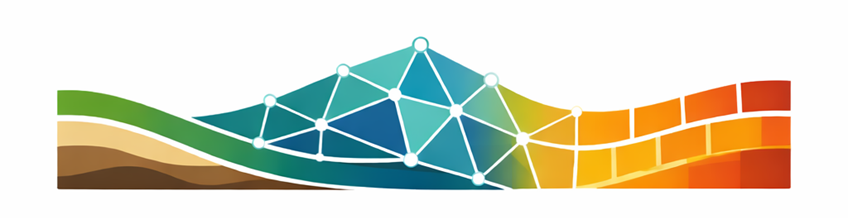
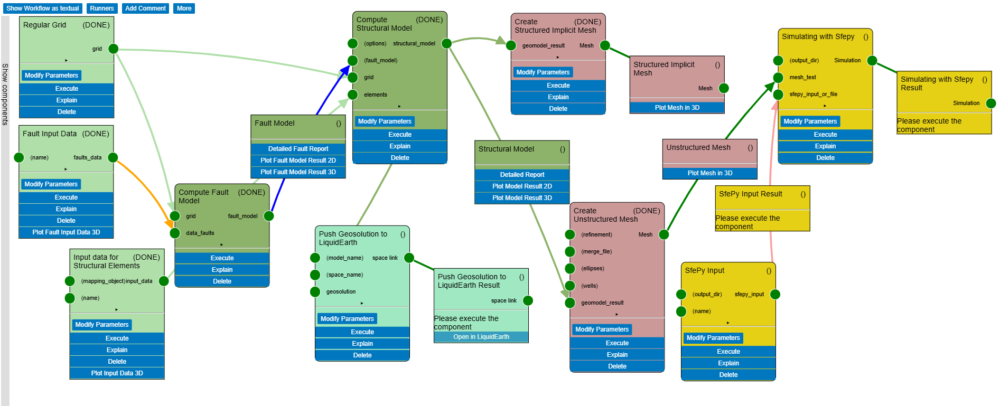
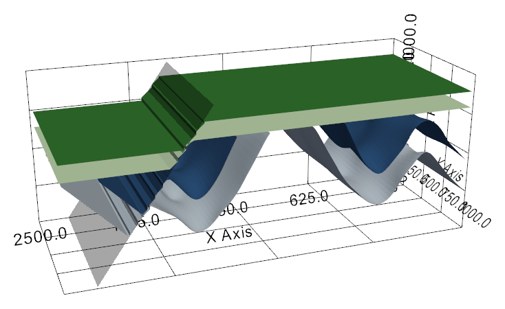
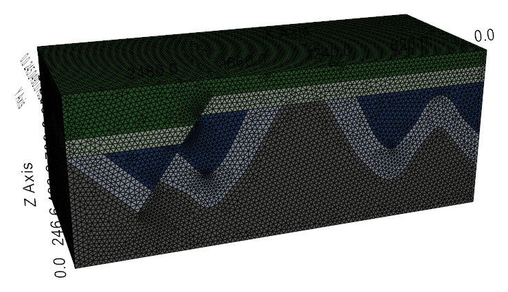
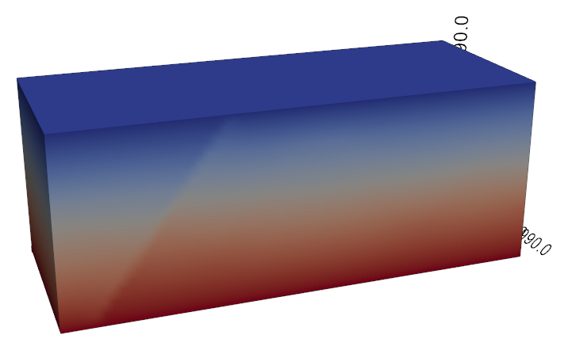
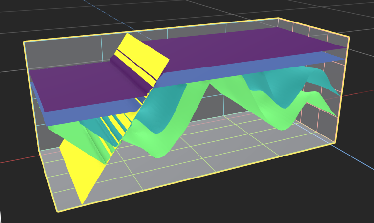

<h1 align="center">
  <picture>
    
  </picture>
</h1>

## WBGeo — A Workbench for Geoscientific Workflows

WBGeo is an open-source workbench for geoscientific workflows — covering structural modeling, mesh generation, process simulation, and visualization in one integrated environment. Its core concept is a component-and-connector system in which workflows are assembled from typed, interchangeable components, each encapsulating a method or processing step behind a standardized interface. The workbench can be accessed directly through Python backend code or through the visual interface (visual DSL). Standardized interfaces make methods across each step exchangeable, enabling systematic comparison without rewriting pipelines.

---

## Getting Started

The fastest way to explore WBGeo is through the **hosted demo** — no installation required. Try the visual interface (visual DSL) directly in your browser:

[View Hosted Demo](https://wbgeo-demo.cloud.luepg.es/gui/Home){ .md-button .md-button--primary }

To run WBGeo locally, follow the installation guide:

[Installation Guide](installation/index.md){ .md-button }

For contributors and developers, see the [developer's guide](developers/index.md) along with documentation on [components](developers/components.md), [types](developers/types.md), and [local execution](developers/local.md).

---

## Workflow

WBGeo is organized around four modeling steps, which can be assembled into a pipeline either through the visual interface (visual DSL), shown below, or directly in Python. Follow the links below for detailed documentation on each step:

{ style="border: 1px solid #ddd; border-radius: 4px; width: 85%;" }

1. :material-layers-triple: **Structural Geological Modeling**

    Reconstruct 3D geological structure from available input data using a set of implicit methods.

    [:octicons-arrow-right-24: Manual](components/structural_modeling/Manual_structural_modeling.md)

    { style="border: 1px solid #ddd; border-radius: 4px; width: 85%;" }

2. :material-cube-outline: **Meshing**

    Generate 3D watertight meshes ready for simulation automatically from the structural model.

    [:octicons-arrow-right-24: Manual](components/meshing/Manual_meshing.md)

    { style="border: 1px solid #ddd; border-radius: 4px; width: 85%;" }

3. :material-play-circle-outline: **Process Simulation**

    Interface with numerical solvers using the meshes from the previous step.

    [:octicons-arrow-right-24: Manual](components/simulation/Manual_simulation.md)

    { style="border: 1px solid #ddd; border-radius: 4px; width: 85%;" }

    <small>*(WIP: Process Simulation is partially under development and not yet part of the public release)*</small>

4. :material-eye-outline: **Visualization**

    Standard 2D and 3D visualization and link to immersive XR, VR, AR visualization using [LiquidEarth](https://www.terranigma-solutions.com/liquidearth).

    [:octicons-arrow-right-24: Manual](components/visualization/Manual_visualization.md)

    { style="border: 1px solid #ddd; border-radius: 4px; width: 85%;" }

---

## Publications

- **von Harten, J., Baes, M., Lüpges, A., Wellmann, F., Cacace, M., Degen, D., Scheck-Wenderoth, M., Rumpe, B. & Niederau, J. (2025)** — *WBGeo - Workbench for Digital Geosystems*. European Geothermal Congress (EGC 2025), Zurich, Switzerland, 6–10 October 2025. [PDF](https://europeangeothermalcongress.eu/wp-content/uploads/2025/11/Jan-von-et-al.pdf)

---

## Funding

  
  
This project was funded by the Federal Ministry of Research, Technology and Space (BMFTR)
  under the <a href="https://www.ptj.de/projektfoerderung/geo-n">Geoforschung für Nachhaltigkeit (GEO:N)</a>
  initiative (Grant no. 03G0922A).

---

## License

WBGeo is released under the [European Union Public Licence v1.2 (EUPL-1.2)](https://joinup.ec.europa.eu/collection/eupl/eupl-text-eupl-12).
