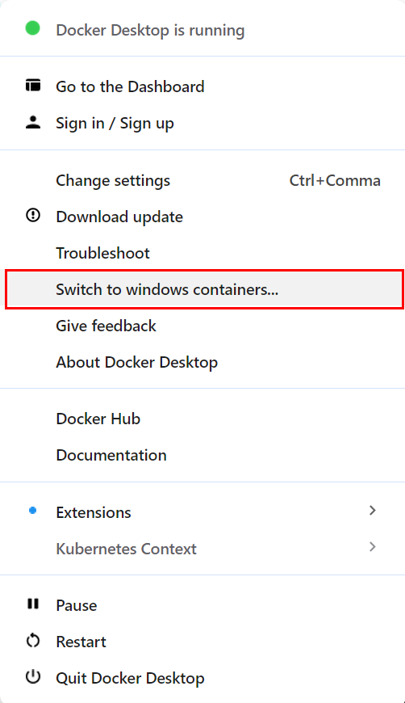

# Visual Editor Installation

This document outlines an installation guide for using the workbench with 
its visual editor.
See the [codebase installation](codebase.md) for how to install the codebase 
to be use-able in Python scripts.

### Step 0: Install Docker

If you are unsure which variant of docker install, we
recommend [Docker Desktop](https://docs.docker.com/desktop/) to you.

* On windows, you might have to toggle docker to use _linux containers_
   1) right-click the Docker Desktop icon in your status bar
   2) click the _Switch to linux containers_ button

   * 


### Step 1: Download the docker-compose.yml

Download the [docker-compose.yml](https://github.com/wbgeo/codebase/blob/main/docker-compose.yml) file to your machine to a
location of your choice.

This file tells docker how to orchestrate the containers required to run the
workbench editor.

(In case you have already checked out the repository:
You can use the docker-compose.yml directory in your git project instead)

### Step 2: Start the workbench editor

Switch to a CLI (e.g. cmd) and change into the directory of the downloaded file.
(If you are unsure where your file is:
Under windows: Shift-right-click the folder containing the file and select _Open
in Terminal_.)

Run the `docker compose up` command in the CLI.

In case you receive an `error during connect` error: Ensure Docker (Desktop) is
running.

### Step 3: Done

Open [http://localhost:8080](http://localhost:8080) in your browser.
You might have to wait for the console to pause its output/the backend to be
ready.

## How to use your own data with the graphical interface:

By default, the docker setup mounts a `own_data` directory,
which allows you to use your own input files.
(Internally, they are mounted to _examples/own_data_.)

## How to update the graphical interface:

Run `docker compose pull`, but Step 2 should update the images automatically.  
Certain updates might require you to also update the _docker-compose.yml_ file,
in which case you will have to perform Steps 1 and 2 again.

## How to reset the graphical interface:

In case the application fails to start after an update, etc.:
Run `docker compose down` to reset the interface.
Then continue with Step 2 to start the interface again

## How to use a local codebase

In your _docker-compose.yml_ file: Go to the `services.py_runner.volumes` key
and uncomment/add the following lines:

```yaml
services:
   py_runner:
      # ...
      volumes:
         - "./path/to/my/codebase/:/usr/src/app/codebase/"
```

Change the `./path/to/my/codebase/` path to point to codebase directory.

(Special case: If you are using the docker-compose.yml from the codebase's
directory, uncomment the `# option 1` lines instead.)

Now the container will start with your local codebase.
After making changes to your local codebase, restart the py_runner container
with `docker compose restart py_runner` to apply them.

In case you have modified the component signatures, you have to reset the stored
components in the database: use
the [Reset](http://localhost:8080/gui/Reset) page and then restart the py_runner
container.
The [Runners](http://localhost:8080/gui/Runners) page might help with dead
runners.

### Configuration Options

The docker image provides a set of configuration options.
Some of these options are only available to the docker container,
while others are set by default and are only available to the runner CLI script.

By default, the setup works without any modifications,

| Environment Variable | CLI Argument  | Description                                 |
|----------------------|---------------|---------------------------------------------|
| `MINIO_HOST`         | `--s3`        | S3 Storage Host                             |
| `S3_ACCESS_KEY`      | `-s3-access`  | Access Key (for S3)                         |
| `S3_SECRET_KEY`      | `--s3-secret` | Secret Key (for S3)                         |
| `BACKEND_HOST`       | `--backend`   | Gem Backend Host                            |
| `PREPARE_TEMPLATES`  | `--templates` | Wheather to  (default false)                |
|                      | `-p`          | Python path of the runner                   |
|                      | `-i`          | Path to import for component loading        |
| `LIQUIDEARTH_TOKEN`  |               | Default token used for the LiquidEarth API. |
